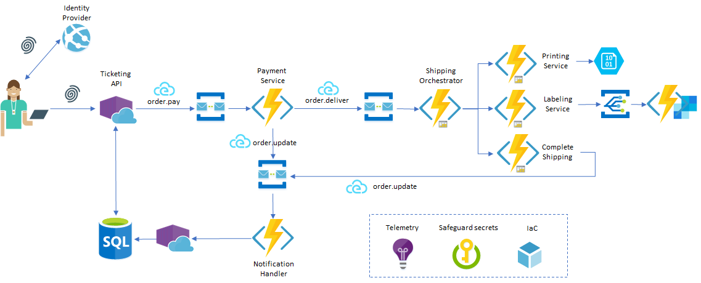

# PaaS Ticketing
Extremely simple PaaS ticketing system used as playground project.
Powered by [Arcus](https://arcus-azure.net) and lot of copying and pasting from Stack Overflow.
The API exposes three endpoints
- REST
- HAL
- GraphQL



## Sources and Types
app://ticketing.api
- command://order.pay

app://ticketing.services.payment
- command://order.deliver
- command://order.update

app://ticketing.services.shipping
- command://order.update

app://ticketing.services.labeling
- event://order.completed

## CloudEvent
Messages and commands are propagated as CloudEvent
```json
{
  "specversion": "0.2",
  "type": "command://order.pay",
  "source": "app://ticketing.api",
  "id": "b273a33d-7e03-43e8-9055-d5724240db50",
  "time": "2019-04-15T13:41:45.2478895Z",
  "contenttype": "application/json",
  "data": "{\"attendee\":\"Test user\",\"orderId\":\"29f9a5c5-0d22-4f07-93c3-1e769337755c\",\"token\":\"b9249d\"}"
}
```

## EventGrid
Example of the EventGrid sample

```json
[
  {
    "id": "a367a3a5-270d-4ae3-be30-2118f7d130d8",
    "subject": "/ticketing/orders/12345678",
    "data": {
      "OrderId": "12345678",
      "Recipient": "massimo.crippa@something.com"
    },
    "eventType": "event://order.completed",
    "eventTime": "2019-04-01T20:47:21.3876192Z",
    "dataVersion": "1.0",
    "metadataVersion": "1",
    "topic": "/subscriptions/{sid}/resourceGroups/{rg}/providers/Microsoft.EventGrid/topics/{topicname}"
  }
]
```

## JsonPatch
Content-Type: json-patch+json
Path: /core/v1/orders/{oid}
```json
[
	{ 
	"op": "replace", 
	"path": "/status", 
	"value": "Paid" 
	}
]
```

## JWT token (client credentials)
```json
{
  "alg": "RS256",
  "kid": "2d44575830a2a4b16d8e68e7c305ad15",
  "typ": "JWT"
}.{
  "nbf": 1556446005,
  "exp": 1556449605,
  "iss": "http://localhost",
  "aud": [
    "http://localhost/resources",
    "api://ticketing-core"
  ],
  "client_id": "ticketingtestapp",
  "scope": [
    "api://ticketing-core"
  ]
}.[Signature]
```


## NuGet Packages
- Microsoft.AspNetCore.TestHost
- Microsoft.Azure.ServiceBus
- Microsoft.Azure.WebJobs.Extensions.ServiceBus
- Microsoft.Azure.WebJobs.Extensions.EventGrid
- Microsoft.Azure.WebJobs.Extensions.SendGrid
- Microsoft.Azure.WebJobs.Extensions.DurableTask
- Microsoft.AspNetCore.JsonPatch
- IdentityServer4.AccessTokenValidation
- CloudNative.CloudEvents
- Microsoft.Azure.Functions.Extensions

## E2E correlation


## HAL (application/hal+json)
```json
{
  "orderId": "4be6ccc1-c969-408f-812f-2290b649212e",
  "eventId": "97934d7d-7bd2-42fc-977e-4709a7cf08a4",
  "eventName": "Rock Werchter 2019",
  "attendeeId": "431ecfb4-e97a-4539-99b8-9f19cb839cf6",
  "attendee": "user5b8e9b95-048f-471b-ae3f-1c957f815912 Test user",
  "ticketDate": "2019-06-09T14:17:33.4630000Z",
  "status": "Delivered",
  "token": "b-5-41",
  "_links": {
    "self": {
      "href": "/core/v1/orders/links/b-5-41"
    },
    "order": {
      "href": "/core/v1/orders/4be6ccc1-c969-408f-812f-2290b649212e"
    },
    "user": {
      "href": "/core/v1/users/431ecfb4-e97a-4539-99b8-9f19cb839cf6"
    },
    "concert": {
      "href": "/core/v1/concerts/97934d7d-7bd2-42fc-977e-4709a7cf08a4"
    }
  }
}
```
embedded
```json
{
  "_links": {
    "self": {
      "href": "/core/v1/concerts"
    }
  },
  "_embedded": {
    "concert": [
      {
        "concertId": "97934d7d-7bd2-42fc-977e-4709a7cf08a4",
        "name": "Rock Werchter 2019",
        "price": 150,
        "location": "Brussels",
        "from": "2019-06-27T00:00:00.0000000Z",
        "to": "2019-06-30T00:00:00.0000000Z",
        "_links": {
          "self": {
            "href": "/core/v1/concerts/97934d7d-7bd2-42fc-977e-4709a7cf08a4"
          },
          "concert:users": {
            "href": "/core/v1/concerts/97934d7d-7bd2-42fc-977e-4709a7cf08a4/users"
          }
        }
      },
      {
        "concertId": "8a50838f-7c76-4fd7-b175-562ecb2856e3",
        "name": "Gent Jazz Festival 2019",
        "price": 120,
        "location": "Gent",
        "from": "2019-06-28T00:00:00.0000000Z",
        "to": "2019-07-09T00:00:00.0000000Z",
        "_links": {
          "self": {
            "href": "/core/v1/concerts/8a50838f-7c76-4fd7-b175-562ecb2856e3"
          },
          "concert:users": {
            "href": "/core/v1/concerts/8a50838f-7c76-4fd7-b175-562ecb2856e3/users"
          }
        }
      }
    ]
  }
}
```

## GraphQL
endpoint: /graphql
playground: /ui/playground

Simple query (POST)
```json
{
  "operationName": null,
  "variables": {    
  },
  "query": "{\n  users {\n    firstname\n    email\n  }\n}\n"
}
```

Result
```json
{
  "data": {
    "users": [
      {
        "firstname": "Tom",
        "email": "t.j@test.com"
      },
      {
        "firstname": "user8598edb5-a33b-425b-8725-675c7e9aa9cc",
        "email": "test@user.com"
      }
    ]
  }
}
```
